# Stablecoin Market Fragmentation: USDC De-Peg Crisis Analysis

**Author:** Nigel Li  
**Competition:** 2026 IAQF Student Competition  
**Topic:** Stablecoin Market Fragmentation and Microstructure during the March 2023 USDC De-Peg Crisis

---

## Overview

A comprehensive empirical analysis of cryptocurrency market behavior during the March 2023 USDC de-peg event. The study addresses four research questions:

1. **Cross-Currency Basis (LOP):** How does the price of BTC/USDT compare to BTC/USD over time, and what drives persistent deviations once transaction costs are considered?
2. **Stablecoin Dynamics:** How do premium/discount patterns in stablecoin-quoted markets vary across exchanges and regimes?
3. **Liquidity & Fragmentation:** Does liquidity differ systematically across quote currencies? How do order book depth, spread, and volatility vary?
4. **Regulatory Overlay:** What are the implications of the GENIUS Act and stablecoin settlement adoption for market structure and efficiency?

---

## Key Results

- **LOP Deviation Peak:** The Law-of-One-Price deviation between BTC/USDC and BTC/USD peaked at over **1,200 bps** during the crisis — a 100-fold increase from the pre-crisis median of −0.17 bps.
- **USDC Discount:** The USDC/USD rate traded at a median discount of **−325 bps** on Binance.US and **−301 bps** on Kraken during the crisis, with a minimum of ~1,400 bps on both venues.
- **Synchronization:** Cross-venue correlation of the USDC deviation jumped from near-zero to **0.91** during the crisis — a systemic, market-wide event.
- **Liquidity Fragmentation:** Kyle's Lambda for BTC/USDC was **64× higher** than for BTC/USDT; Amihud illiquidity was **4.4× higher**. Spreads for both BTC/USD and BTC/USDT more than **doubled**.
- **Arbitrage Breakdown:** The OU half-life of the LOP deviation increased from **3.2 minutes** pre-crisis to **602.7 minutes (10.0 hours)** during the crisis.
- **Contagion:** Bybit (offshore, non-USD) also experienced significant stress with spreads widening **2.5×**, highly correlated with the Binance.US de-peg event.

---

## Figures

### Main Narrative Figures

| Figure | Description |
|---|---|
|  | **Fig. 1** — Price & LOP overview |
|  | **Fig. 2** — Stablecoin de-peg dynamics |
|  | **Fig. 3** — Crisis deep dive |
|  | **Fig. 4** — Kyle's Lambda (price impact) |
|  | **Fig. 5** — Regression coefficients |

### Liquidity & Spread Analysis


### Arbitrage Simulation

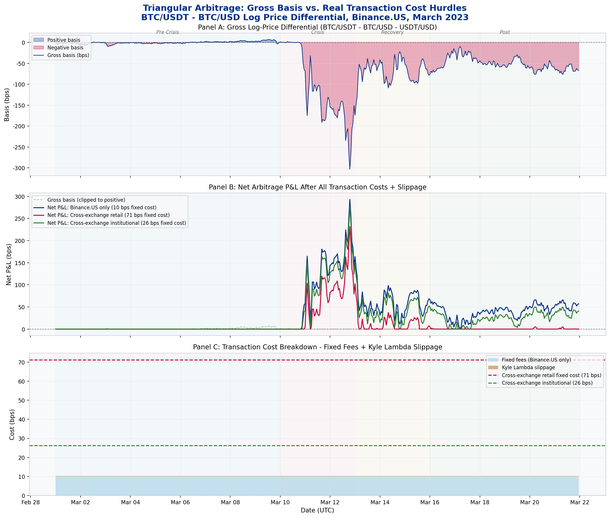

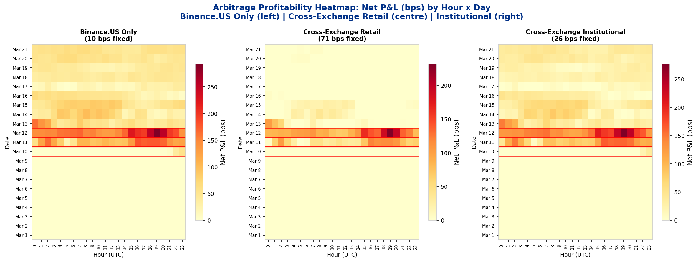

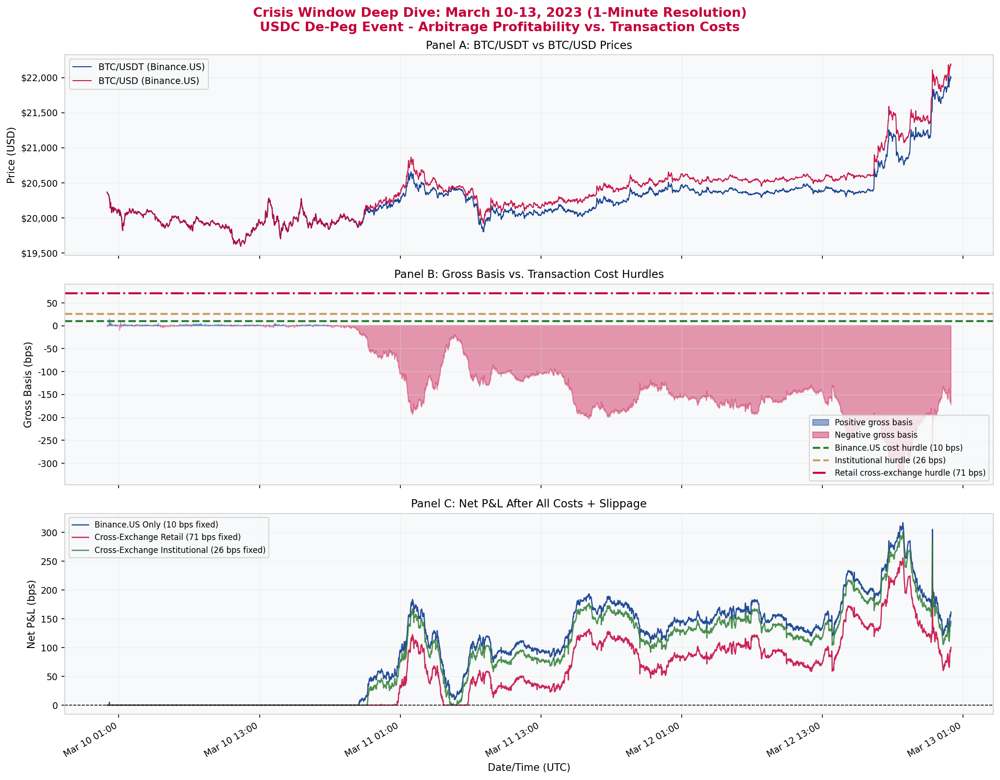

### OU Mean-Reversion Analysis

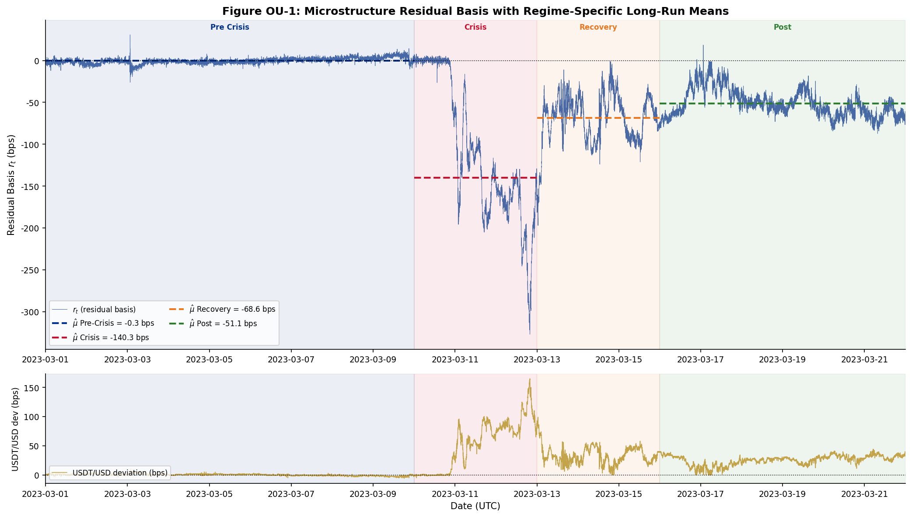

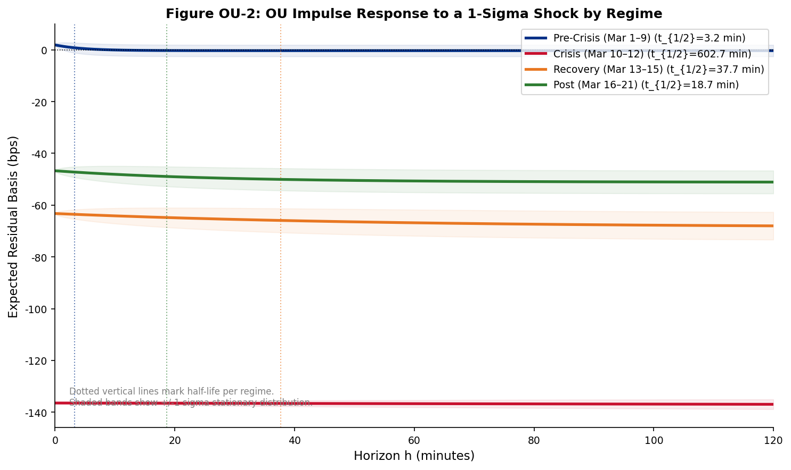

### Cross-Exchange Analysis

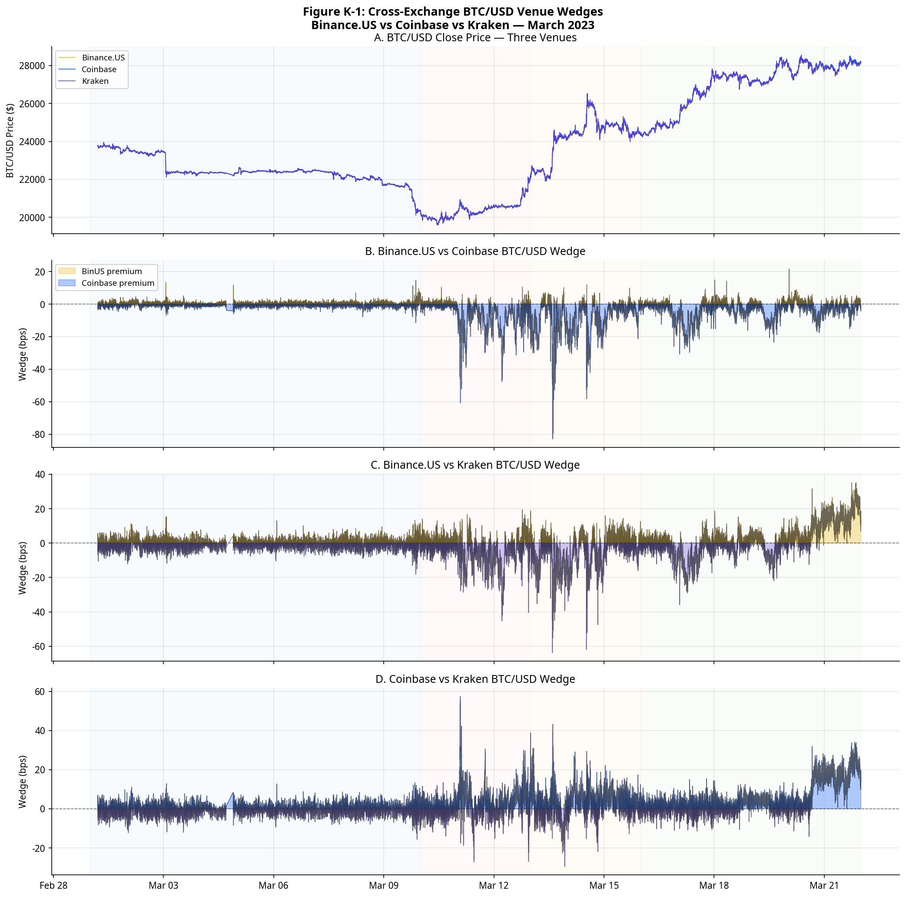

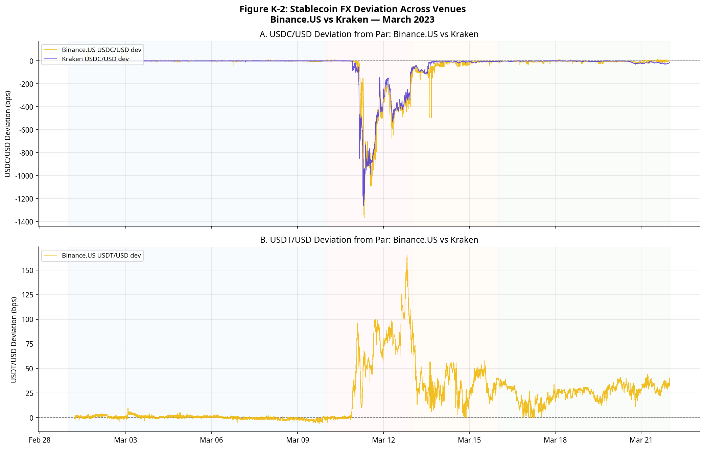

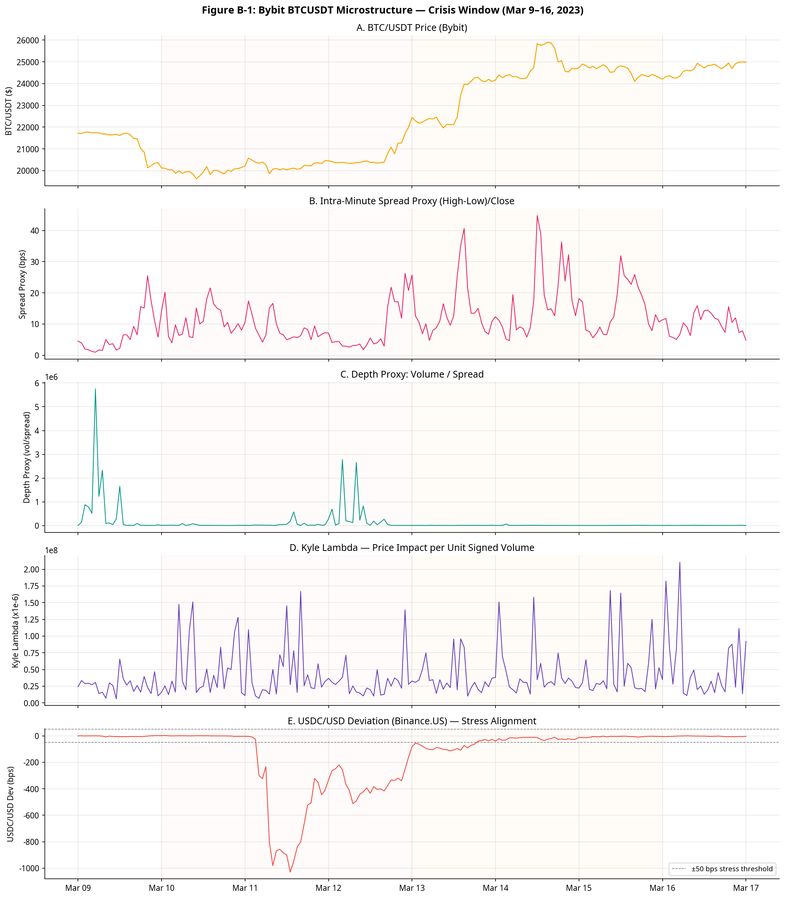

### Advanced Models

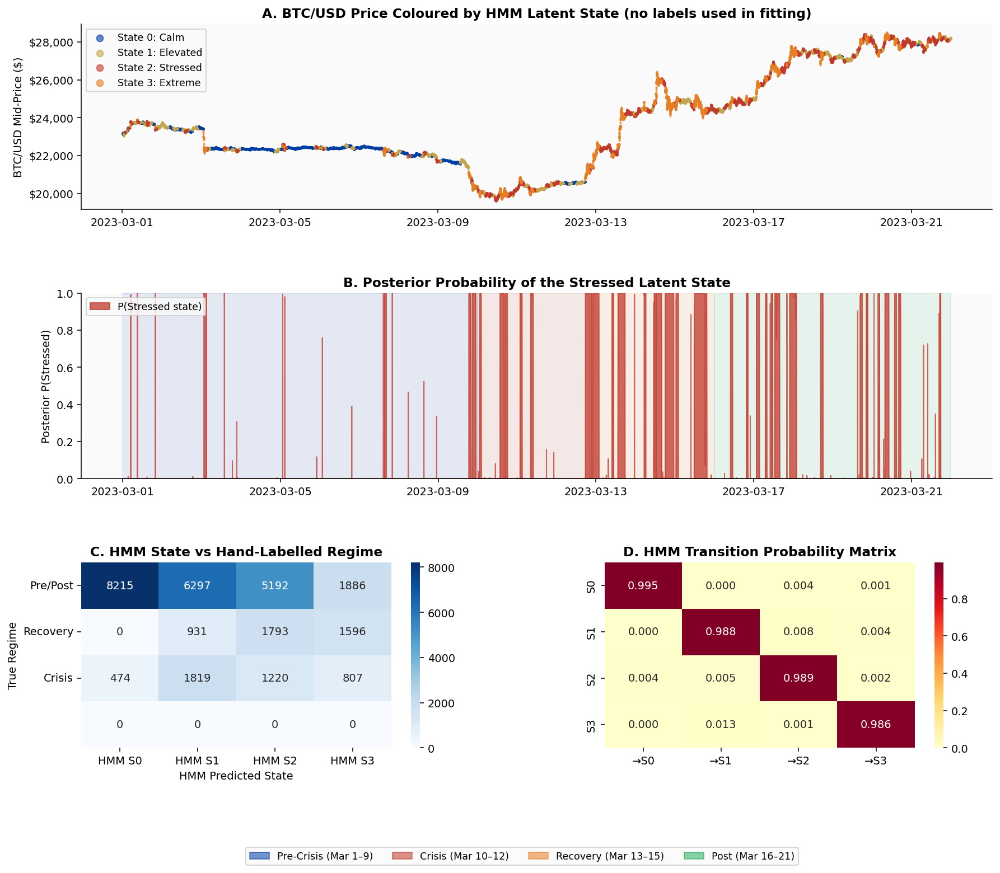

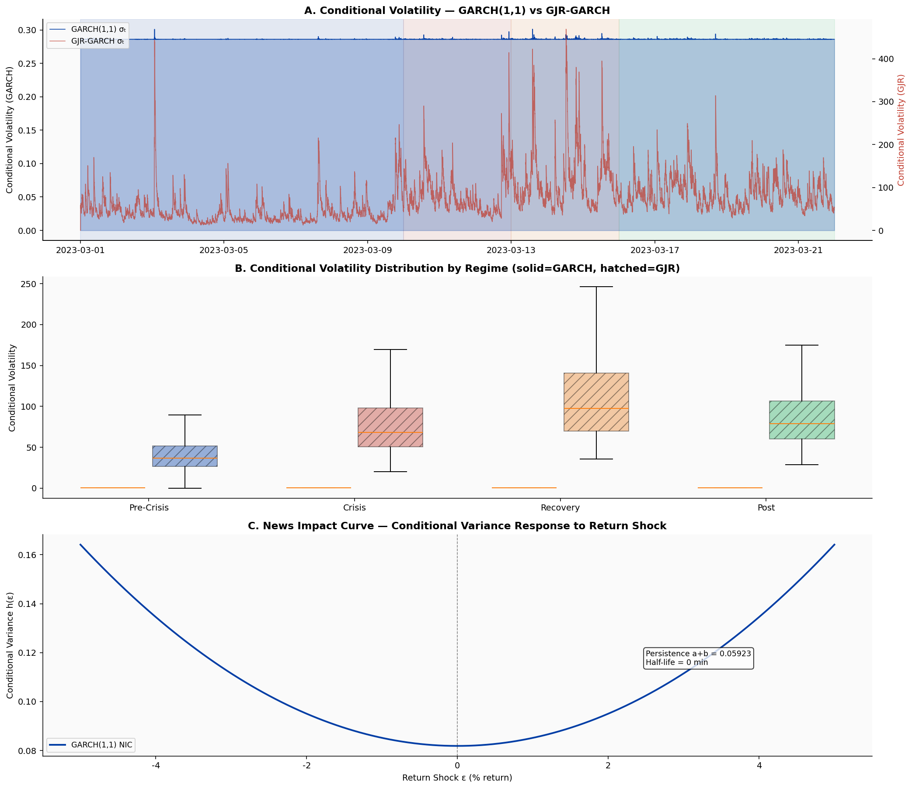

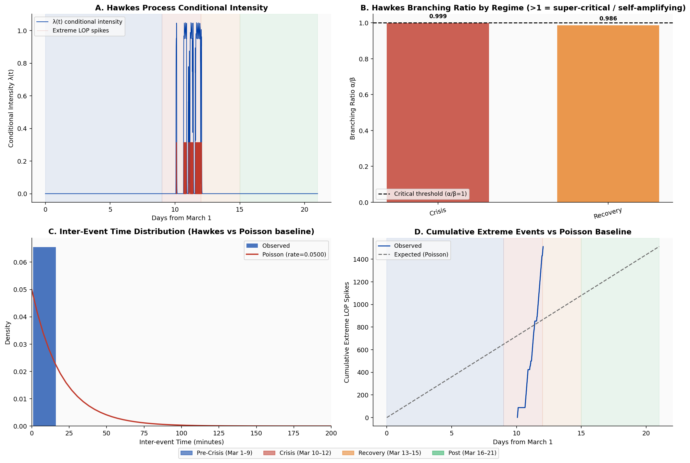

---

## Paper Artifact Map

### Main Figures (Fig. 1–7)

| Paper Label | Repo Path | Producer | Data Source |
|:---|:---|:---|:---|
| **Fig. 1** | `figures/master/master_fig1_price_lop_overview.png` | `IAQF_Master_Analysis.ipynb` | `panel_1hour.parquet` |
| **Fig. 2** | `figures/master/master_fig3_stablecoin_depeg.png` | `IAQF_Master_Analysis.ipynb` | `panel_1min.parquet` |
| **Fig. 3** | `figures/master/master_fig9_crisis_deep_dive.png` | `IAQF_Master_Analysis.ipynb` | `panel_1min.parquet` |
| **Fig. 4** | `figures/master/master_fig6_kyle_lambda.png` | `IAQF_Master_Analysis.ipynb` | `l2_all_pairs_1min.parquet` |
| **Fig. 5** | `figures/master/master_fig11_regression_coefs.png` | `IAQF_Master_Analysis.ipynb` | `panel_1min.parquet` |
| **Fig. 6** | `figures/lop/fig_x_spread_depth_vol.png` | `compute_table_x.py` | `panel_1min.parquet` |
| **Fig. 7** | `figures/lop/fig_r1_genius_sensitivity.png` | `compute_sensitivity_table.py` | `table_sensitivity_genius.csv` |

### Appendix Figures

| Paper Label | Repo Path | Producer |
|:---|:---|:---|
| **Fig. K-1** | `figures/kraken/kraken_fig1_wedge_timeseries.png` | `IAQF_CrossExchange_Kraken.ipynb` |
| **Fig. K-2** | `figures/kraken/kraken_fig2_stablecoin_fx.png` | `IAQF_CrossExchange_Kraken.ipynb` |
| **Fig. K-3** | `figures/kraken/kraken_fig3_regime_bars.png` | `IAQF_CrossExchange_Kraken.ipynb` |
| **Fig. B-1** | `figures/bybit/bybit_fig1_crisis_window.png` | `IAQF_CrossExchange_Bybit_executed.ipynb` |
| **Fig. OU-1** | `figures/ou/ou_fig1_residual_timeseries.png` | `IAQF_OU_Analysis_executed.ipynb` |
| **Fig. OU-2** | `figures/ou/ou_fig2_impulse_response.png` | `IAQF_OU_Analysis_executed.ipynb` |

### Tables

| Paper Label | Description | Producer |
|:---|:---|:---|
| **Table VII** | Stablecoin Premia/Discounts | `compute_table_vii.py` |
| **Table VIII** | Cross-Venue Correlation | `compute_table_vii.py` |
| **Table IX** | USDC vs USDT Confidence | `compute_table_vii.py` |
| **Table X** | Spread, Depth, Volatility | `compute_table_x.py` |
| **Table XI** | Stress Ratios | `compute_table_x.py` |
| **Table B-1** | Bybit Microstructure | `IAQF_CrossExchange_Bybit_executed.ipynb` |
| **Table OU-1** | OU Parameters & Half-Life | `IAQF_OU_Analysis_executed.ipynb` |

---

## How to Run

### Prerequisites

```bash
pip install pandas numpy matplotlib seaborn statsmodels scipy \
            hmmlearn arch scikit-learn tslearn openpyxl pyarrow \
            requests jupyter nbformat nbconvert
```

### Step 1 — Generate LOP panel data (~5 min)

```bash
python generate_data.py --skip-l2
```

Fetches 1-minute OHLCV data from Binance.US and Coinbase, builds the harmonized panel, saves `panel_1min.parquet`, `panel_1hour.parquet`, and `panel_daily.parquet` to `data/parquet/`. `--skip-l2` skips the ~20 GB tick data download.

### Step 2 — L2 microstructure data (~60–90 min, optional)

```bash
python generate_data.py
```

Downloads ~20 GB of `aggTrades` tick data from the Binance public archive and processes ~150 million trades into 1-minute L2 metrics.

### Step 3 — Cross-exchange data (~2 hours, optional)

```bash
python fetch_cross_exchange.py
```

Fetches Kraken tick trades (BTC/USD, USDC/USD, USDT/USD, USDC/USDT) and Bybit BTC/USDT tick data via public REST APIs.

### Step 4 — Run notebooks

```bash
cd notebooks/
jupyter notebook IAQF_Master_Analysis.ipynb
```

**Notebook dependency summary:**

| Notebook | Data Required | Self-Fetches? |
|---|---|---|
| `IAQF_Master_Analysis.ipynb` | `panel_1min.parquet` + L2 files | No — run `generate_data.py` first |
| `IAQF_Advanced_Models.ipynb` | `panel_1min.parquet` | No — run `generate_data.py --skip-l2` first |
| `IAQF_Arbitrage_Simulation_executed.ipynb` | `panel_1min.parquet` | No |
| `IAQF_BasisRisk_Analysis_executed.ipynb` | `panel_1min.parquet` | No |
| `IAQF_OU_Analysis_executed.ipynb` | None | **Yes** — fetches from Binance.US API |
| `IAQF_CrossExchange_Bybit_executed.ipynb` | `data/cross_exchange/bybit_btcusdt_1min.parquet` | Partially |
| `IAQF_CrossExchange_Kraken.ipynb` | `data/cross_exchange/kraken_*.parquet` | Partially |

---

## Directory Structure

```
IAQF_2026/
├── notebooks/
│   ├── IAQF_Master_Analysis.ipynb                ← Phase 1 (LOP) + Phase 2 (L2)
│   ├── IAQF_Advanced_Models.ipynb                ← HMM, GARCH, VAR, RF, DTW, MS, Hawkes, PCA
│   ├── IAQF_Arbitrage_Simulation_executed.ipynb  ← Triangular arbitrage simulation
│   ├── IAQF_BasisRisk_Analysis_executed.ipynb    ← Basis decomposition, stress, tails
│   ├── IAQF_OU_Analysis_executed.ipynb           ← OU mean-reversion by regime
│   ├── IAQF_CrossExchange_Bybit_executed.ipynb   ← Bybit L2 order book analysis
│   └── IAQF_CrossExchange_Kraken.ipynb           ← Kraken 3-way BTC/USD venue wedge
├── data/
│   ├── parquet/                                  ← Generated by generate_data.py
│   │   ├── panel_1min.parquet                    ← 30,240 rows × 74 cols — main LOP panel
│   │   ├── panel_1hour.parquet
│   │   ├── panel_daily.parquet
│   │   ├── l2_BTCUSDT_1min.parquet
│   │   ├── l2_BTCUSDC_1min.parquet
│   │   └── l2_all_pairs_1min.parquet
│   └── cross_exchange/                           ← Generated by fetch_cross_exchange.py
│       ├── kraken_btcusd_1min.parquet
│       ├── kraken_usdcusd_1min.parquet
│       ├── bybit_btcusdt_1min.parquet
│       └── ...
├── generate_data.py                              ← Generates data/parquet/ files
├── fetch_cross_exchange.py                       ← Generates data/cross_exchange/ files
├── compute_table_vii.py
├── compute_table_x.py
├── compute_sensitivity_table.py
├── figures/                                      ← 30+ output figures
│   ├── master/
│   ├── advanced/
│   ├── arb/
│   ├── br/
│   ├── ou/
│   ├── bybit/
│   ├── kraken/
│   └── lop/
└── docs/
    └── IAQFStudentCompetition2026.pdf            ← Competition problem statement
```
