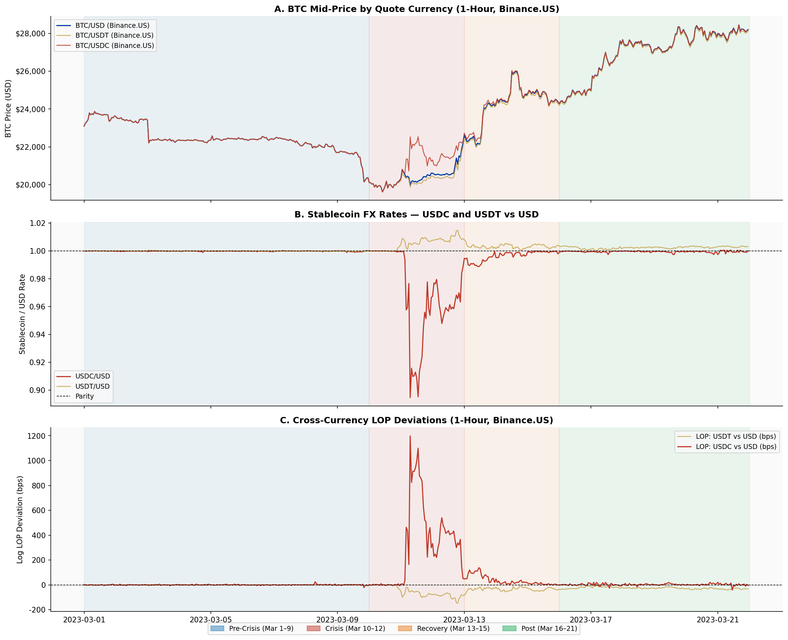
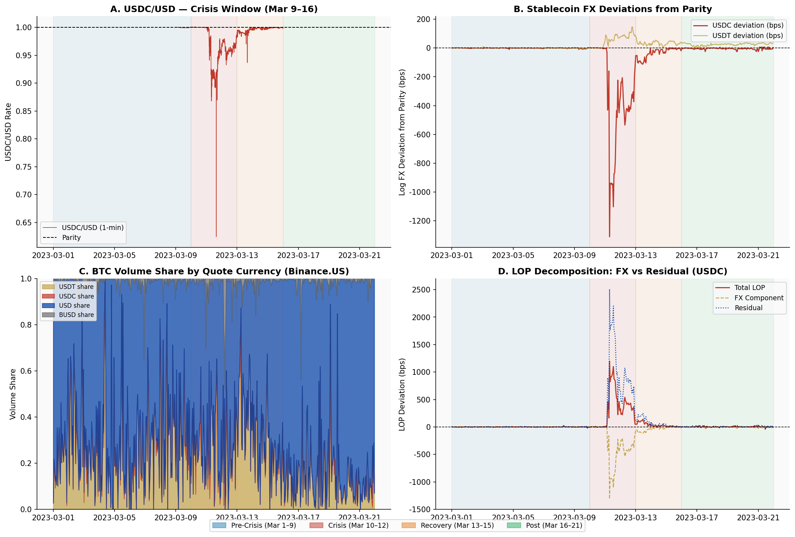
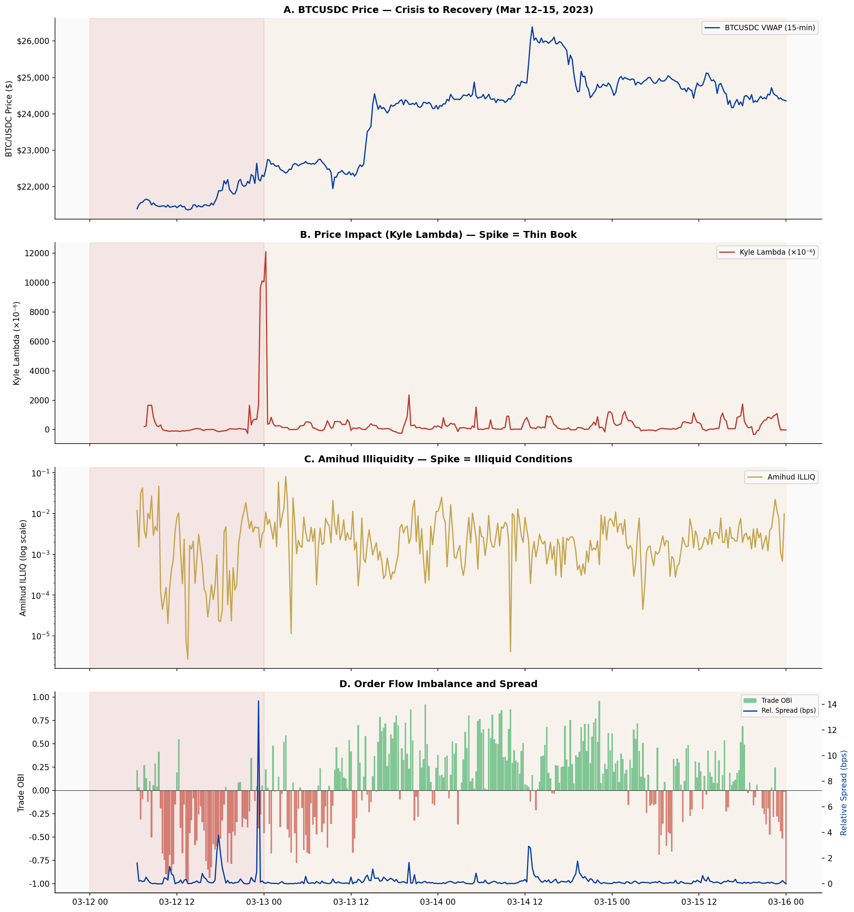
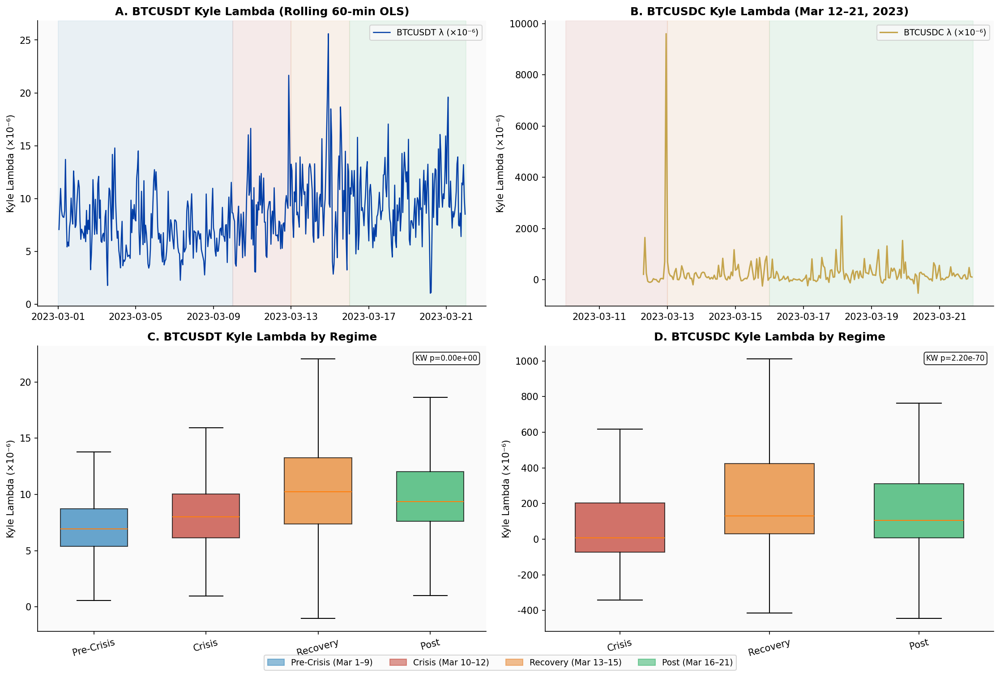
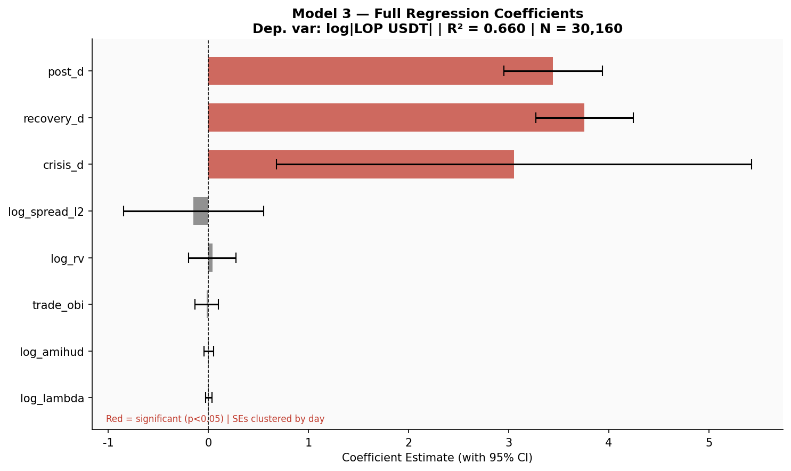
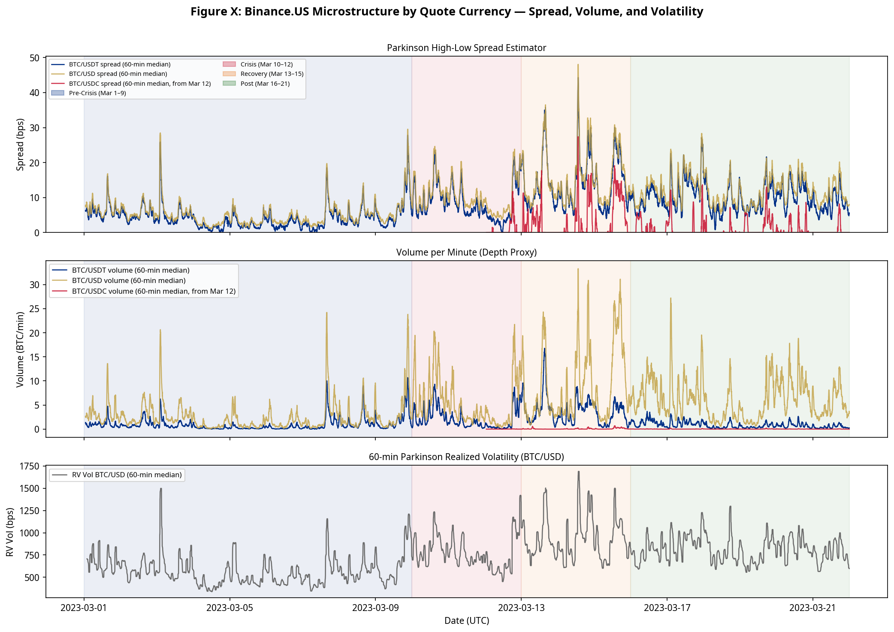
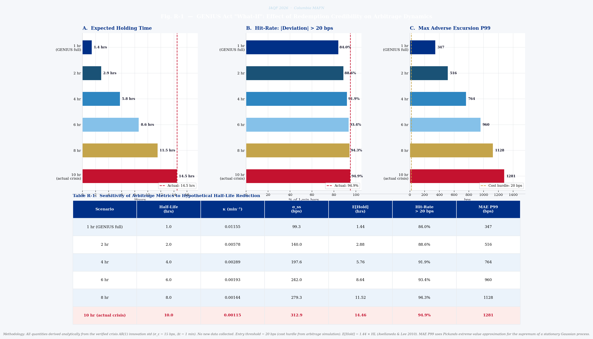

# When "$1" Is Not One: Stablecoin Discounts and Market Fragmentation

**Team:** Bayes on the River, Columbia University Mathematics of Finance<br>
**Captain:** Nigel Li<br>
**Competition:** 2026 IAQF Academic Affiliate Membership Student Competition<br>
**Recognition:** Selected as one of six winning teams in the Fifteenth Annual IAQF Student Competition.<br>
**Focus:** Law-of-one-price deviations, stablecoin funding stress, liquidity fragmentation, and arbitrage limits during the March 2023 USDC de-peg.

This repository contains the final paper, IAQF winners notice, empirical notebooks, data panels, figures, and addendum for a study of how stablecoin stress propagated through BTC spot markets during the March 2023 USDC de-peg. The analysis combines 1-minute and 1-hour price panels, stablecoin FX rates, order-book microstructure measures, cross-exchange comparisons, arbitrage simulations, and mean-reversion models.

## Submission Documents

The official IAQF-hosted winning paper and winners announcement are stored locally in `docs/submission/` so the repository remains self-contained even if signed CDN links expire.

| Document | Path |
|---|---|
| Official winning paper | [`docs/submission/Columbia_Bayes_on_the_River.pdf`](docs/submission/Columbia_Bayes_on_the_River.pdf) |
| Official IAQF winners announcement | [`docs/submission/IAQF_2026_winners_notice.pdf`](docs/submission/IAQF_2026_winners_notice.pdf) |
| Technical addendum | [`IAQF 2026 Paper (CIP) - Addendum.pdf`](IAQF%202026%20Paper%20%28CIP%29%20-%20Addendum.pdf) |
| Competition prompt | [`docs/IAQFStudentCompetition2026.pdf`](docs/IAQFStudentCompetition2026.pdf) |

## Research Questions

1. How large did BTC law-of-one-price deviations become across USD, USDT, and USDC quote currencies?
2. Did stablecoin discounts transmit into spot BTC markets and liquidity conditions?
3. How did spreads, depth, price impact, and realized volatility differ by quote currency during the crisis?
4. When did arbitrage become economically infeasible after transaction costs, latency, and capital haircuts?
5. What do these results imply for stablecoin settlement adoption and market-structure policy?

## Paper Narrative

The paper treats the March 2023 USDC de-peg as a natural experiment in **unit-of-account risk**. Crypto spot markets often quote and settle in stablecoins that are supposed to represent one dollar. When that representation is credible, BTC/USD, BTC/USDT, and BTC/USDC markets should stay tightly linked by arbitrage. When redemption credibility is questioned, the quote currency itself becomes risky, and the same BTC exposure can trade at different effective dollar prices across quote books.

The central argument is therefore not just that USDC fell below par. It is that a stablecoin confidence shock propagates through three connected channels:

1. **Price formation:** Stablecoin discounts mechanically enter BTC/stablecoin quotes and open law-of-one-price wedges against BTC/USD.
2. **Market structure:** Cross-venue and cross-quote segmentation makes the residual wedge persist even after adjusting for the stablecoin FX leg.
3. **Liquidity and arbitrage:** The same stress window brings wider spreads, higher price impact, thinner effective depth, and slower convergence, so dislocations are hardest to trade precisely when they are largest.

The regulatory overlay follows from this mechanism. A GENIUS-style stablecoin framework and broader payment-rail adoption matter because they target redemption credibility and reserve transparency. In the paper's framework, better credibility should reduce left-tail stablecoin discounts and shorten normalization times, but it may not fully eliminate residual wedges caused by venue segmentation, transfer frictions, and jurisdictional liquidity fragmentation.

## Methodology

### Data Design

- **Sample window:** March 1-21, 2023 UTC at one-minute frequency, covering 30,240 observations around the USDC de-peg.
- **Core price panel:** Binance.US and Coinbase OHLCV data for BTC quoted in USD and stablecoins, plus Binance.US stablecoin parity series such as USDC/USD and USDT/USD.
- **Microstructure data:** Binance public aggTrades and one-second kline data aggregated to one-minute liquidity measures.
- **Cross-exchange validation:** Kraken and Bybit tick data aggregated to one minute to test whether the observed stress was specific to Binance.US or visible across venues.
- **Regimes:** Fixed event-study windows: pre-crisis (Mar 1-9), crisis (Mar 10-12), recovery (Mar 13-15), and post-crisis (Mar 16-21), applied consistently across datasets.

### Empirical Framework

The analysis builds a log law-of-one-price wedge for BTC across quote currencies:

```math
b_t^{(q)}
= \ln P_t^{\mathrm{BTC}/q}
- \ln P_t^{\mathrm{BTC}/\mathrm{USD}}
- \ln S_t^{q/\mathrm{USD}},
\qquad q \in \{\mathrm{USDT}, \mathrm{USDC}\}
```

Under frictionless parity and a dollar-equivalent quote currency, $b_t^{(q)} = 0$. A positive or negative wedge indicates that BTC quoted in stablecoin $q$, after converting the quote currency back into dollars, is expensive or cheap relative to BTC/USD.

This separates the observed cross-quote deviation into:

- a **stablecoin FX leg**, measuring the stablecoin's own deviation from one dollar;
- a **residual market-structure leg**, measuring quote-book and venue dispersion after adjusting for the stablecoin discount.

The paper then layers on four tests:

- **Stationarity and cointegration:** ADF and Engle-Granger tests verify that the constructed wedge is mean-reverting in the long run rather than a drifting spread.
- **OU mean reversion:** Regime-specific AR(1) estimates are mapped into Ornstein-Uhlenbeck speeds and half-lives, translating persistence into minutes or hours.
- **Arbitrage implementability:** Observed basis deviations are compared against round-trip transaction-cost hurdles; hit rates measure how often deviations clear realistic no-trade bands.
- **Liquidity fragmentation:** Kyle's lambda, Amihud illiquidity, range-based spread proxies, volume-based depth proxies, and realized volatility are compared across quote currencies and regimes.

For arbitrage implementability, a deviation is treated as actionable only when it clears the relevant round-trip cost hurdle:

```math
|b_t| > c_{\mathrm{roundtrip}}
```

where $c_{\mathrm{roundtrip}}$ includes exchange fees, estimated slippage, and other execution frictions for the scenario being evaluated.

### OU Mean-Reversion Model

The OU analysis asks how quickly a cross-quote dislocation closes after it opens. The paper first estimates a regime-specific AR(1) model for the residual basis wedge:

```math
b_{t+1} = \alpha + \phi b_t + \varepsilon_{t+1},
\qquad
\varepsilon_{t+1} \stackrel{i.i.d.}{\sim} (0,\sigma_\varepsilon^2)
```

where $b_t$ is the log parity deviation after adjusting for the stablecoin/USD rate. The fitted $\phi$ measures persistence. A lower $\phi$ means deviations decay quickly; a $\phi$ close to one means the wedge behaves almost like a random walk over the sampled horizon.

To express this persistence in economic time, the discrete AR(1) estimate is mapped into the continuous-time Ornstein-Uhlenbeck process:

```math
db_t = \kappa(\mu - b_t)\,dt + \sigma\,dW_t
```

with the conversion:

```math
\kappa = -\frac{\ln(\phi)}{\Delta t},
\qquad
t_{1/2} = \frac{\ln(2)}{\kappa}
```

Because the data are sampled at one-minute frequency, $\Delta t = 1$ minute. The half-life $t_{1/2}$ is therefore directly interpretable as the expected number of minutes for a shock to decay halfway back toward its regime mean. In the paper, the pre-crisis estimate implies a half-life of **3.2 minutes**, while the crisis estimate implies **602.7 minutes**, or roughly **10 hours**. This is the core arbitrage-capacity result: the wedge does not merely get larger during the de-peg; it also becomes much slower to normalize.

### Liquidity Metrics

The microstructure section compares market quality across quote currencies using one-minute aggregates. Kyle's lambda measures price impact per unit of signed order flow:

```math
\Delta p_t = \ln P_t^{\mathrm{close}} - \ln P_t^{\mathrm{open}},
\qquad
q_t = \sum_{i \in t} s_i v_i
```

```math
\lambda_t = \frac{|\Delta p_t|}{|q_t| + \epsilon}
```

where $s_i \in \{-1,+1\}$ signs each trade and $v_i$ is trade size. A larger $\lambda_t$ means prices move more for a given amount of net buying or selling pressure.

Amihud illiquidity measures absolute return per unit of trading volume:

```math
\mathrm{ILLIQ}_t = \frac{|r_t|}{\mathrm{Volume}_t}
```

The spread and depth proxies are:

```math
\mathrm{SpreadProxy}_t
= \frac{\mathrm{High}_t - \mathrm{Low}_t}{\mathrm{Close}_t} \times 10{,}000
```

```math
\mathrm{DepthProxy}_t
= \frac{\mathrm{Volume}_t}{\mathrm{SpreadProxy}_t}
```

Together, these measures connect the pricing wedge to execution quality: during the de-peg, the dislocation widens while price impact and spread conditions also deteriorate.

### Addendum: Synthetic Stablecoin Cross-Currency Basis

The addendum extends the paper by connecting stablecoin premia/discounts to the traditional **cross-currency basis** concept. In covered interest parity, spot and forward exchange rates should satisfy:

```math
1 + R_b
= \frac{S}{F}(1 + R_f)
```

In practice, funding pressure and balance-sheet frictions create a basis wedge $\beta$:

```math
1 + R_b
= \frac{S}{F}(1 + R_f + \beta)
```

The addendum applies this intuition to crypto markets, where liquid deliverable forwards are limited but perpetual swaps provide a forward-like funding signal. A synthetic USD/stablecoin forward premium can be formed by pairing BTC/stablecoin perpetual pricing with BTC/USD perpetual pricing and comparing the implied forward-like rate to spot:

```math
\mathrm{Basis}_t
= \frac{F_t}{S_t} - 1
```

Using a 30-day moving average, the addendum compares implied USD/USDT and USD/USDC basis dynamics. The interpretation is that positive basis reflects relatively tighter USD funding or a lower stablecoin convenience yield, while negative basis reflects relatively tighter stablecoin funding or a higher stablecoin convenience yield. The addendum finds that USDT and USDC basis behavior diverges across regimes: USDC appears more sought after during stress periods, while USDT tends to dominate during broad crypto rallies. It also notes that the USDT-USDC basis differential has recently converged, consistent with the possibility that stablecoin regulation and market maturation are making the two stablecoins behave more similarly.

## Key Findings

- **Law-of-one-price dislocation:** BTC/USDC versus BTC/USD deviations reached more than **1,200 bps** during the crisis, compared with a pre-crisis median near zero.
- **Stablecoin funding shock:** USDC/USD traded at a median discount of roughly **300 bps** during the crisis on Binance.US and Kraken, with intraday stress substantially larger at the trough.
- **Venue synchronization:** Cross-venue USDC deviation correlation rose to approximately **0.91**, indicating a systemic stablecoin shock rather than an isolated exchange anomaly.
- **Liquidity fragmentation:** BTC/USDC price impact was materially higher than BTC/USDT, and quoted spreads widened across both stablecoin- and dollar-quoted markets.
- **Arbitrage impairment:** Estimated OU half-life increased from **3.2 minutes** before the crisis to **602.7 minutes** during the crisis, showing that deviations persisted when balance-sheet and execution constraints tightened.
- **Cross-exchange contagion:** Bybit and Kraken evidence shows the stress was not confined to Binance.US; offshore and cross-venue markets also reflected the de-peg.
- **Addendum basis evidence:** A synthetic stablecoin cross-currency-basis exercise using perpetual-swap pricing shows that USDT and USDC funding/convenience-yield dynamics differ by regime, with the basis differential widening in stress and narrowing as stablecoin markets mature.

## Interpretation

The results imply that stablecoin stress should be treated as both **basis risk** and **liquidity risk**. In normal periods, stablecoin-quoted BTC prices behave nearly dollar-equivalent. During stress, the stablecoin discount, cross-venue segmentation, and deteriorating execution conditions reinforce each other. That is why the paper emphasizes tail behavior and normalization speed, not just average parity: a three-minute half-life is a transient pricing disturbance, while a ten-hour half-life becomes an inventory, funding, and drawdown problem.

## Data Sources and Method References

The paper relies on public market-data APIs and established empirical finance methods. The most important sources are listed here so the repository is self-contained and the empirical provenance is clear.

### Market Data Sources

| Source | Use in analysis |
|---|---|
| [Binance.US API documentation](https://docs.binance.us/) | Binance.US 1-minute OHLCV for BTC/USD, BTC/USDT, BTC/USDC, BTC/BUSD, and stablecoin parity pairs such as USDC/USD and USDT/USD. |
| [Binance Spot API documentation](https://developers.binance.com/docs/binance-spot-api-docs/rest-api) and [Binance public data archive](https://data.binance.vision/) | Public aggTrades and one-second/tick-derived Binance microstructure inputs used for price-impact, illiquidity, spread, depth, and volume measures. |
| [Coinbase Exchange API documentation](https://docs.cdp.coinbase.com/exchange/docs/welcome) | Coinbase BTC/USD, BTC/USDC, and BTC/USDT candle data used in the harmonized cross-quote price panel. |
| [Kraken REST API documentation](https://docs.kraken.com/rest/) | Kraken BTC/USD, USDC/USD, USDT/USD, and USDC/USDT data used to validate whether stablecoin discounts were synchronized across venues. |
| [Bybit public spot trade archive](https://public.bybit.com/spot/) | Bybit BTC/USDT and BTC/USDC spot trade data used for offshore cross-exchange robustness checks. |

### Methodology References

| Reference | Role in paper |
|---|---|
| Uhlenbeck and Ornstein, “[On the theory of the Brownian motion](https://doi.org/10.1103/PhysRev.36.823),” *Physical Review*, 1930 | Continuous-time OU mean-reversion model used to translate parity-wedge persistence into half-lives. |
| Engle and Granger, “Co-integration and error correction,” *Econometrica*, 1987 | Cointegration framework used to test whether BTC cross-quote prices share a long-run equilibrium. |
| Dickey and Fuller, “Distribution of the estimators for autoregressive time series with a unit root,” *Journal of the American Statistical Association*, 1979 | ADF stationarity tests for price levels, stablecoin deviations, and constructed basis wedges. |
| Chan, Karolyi, Longstaff, and Sanders, “An empirical comparison of alternative models of the short-term interest rate,” *Journal of Finance*, 1991 | Background for comparing mean-reversion specifications and interpreting OU-style persistence. |
| Makarov and Schoar, “[Price discovery in cryptocurrency markets](https://doi.org/10.1257/pandp.20191020),” *AEA Papers and Proceedings*, 2019 | Crypto market segmentation and limits-to-arbitrage motivation. |
| Kyle, “Continuous auctions and insider trading,” *Econometrica*, 1985 | Kyle's lambda price-impact measure. |
| Amihud, “Illiquidity and stock returns,” *Journal of Financial Markets*, 2002 | Amihud illiquidity measure. |

### Policy and Market-Structure Context

| Source | Use in analysis |
|---|---|
| Federal Reserve Board stablecoin risk materials, including “[Primary and Secondary Markets for Stablecoins](https://www.federalreserve.gov/econres/notes/feds-notes/primary-and-secondary-markets-for-stablecoins-20240223.html)” | Stablecoin redemption, reserve, and secondary-market stress context. |
| U.S. House Committee on Financial Services, section-by-section summary of the GENIUS Act, as cited in the paper | Policy framework for payment stablecoin reserve backing, redemption credibility, and public reporting. |
| Visa, “[Visa expands USDC settlement capabilities](https://usa.visa.com/about-visa/newsroom/press-releases.html)” | Motivation for why stablecoin settlement infrastructure matters for market quality and operational risk. |

## Figure Guide

### Figure 1: Price and LOP Overview



Figure 1 establishes the core law-of-one-price fact. BTC prices quoted in USD, USDT, and USDC are tightly aligned before the event, but the adjusted parity wedge expands sharply during the USDC de-peg. The figure makes the unit-of-account channel visible: when USDC trades below one dollar, BTC/USDC can diverge from BTC/USD even if the underlying BTC exposure is the same.

### Figure 2: Stablecoin De-Peg Dynamics



Figure 2 separates the stablecoin shock from the BTC price series. USDC/USD develops a pronounced left-tail discount during the crisis while USDT remains comparatively stable. The decomposition panels show that the observed BTC cross-quote wedge contains both a stablecoin FX component and a residual market-segmentation component.

### Figure 3: Crisis Deep Dive



Figure 3 zooms into the March 10-13 stress window. It shows that the dislocation is not just a one-minute spike: the LOP wedge, implied liquidity stress, and order-flow imbalance all move together through the event. This supports the paper's interpretation that de-peg stress interacts with execution conditions and market depth.

### Figure 4: Quote-Currency Price Impact



Figure 4 reports Kyle's lambda, the price-impact measure used to compare quote-currency liquidity. BTC/USDC is substantially more price-impacting than BTC/USDT during the available stress regimes. In practical terms, the same amount of signed trading pressure moves the USDC-quoted BTC book more, which is evidence of liquidity fragmentation across quote currencies.

### Figure 5: Regression Evidence



Figure 5 summarizes the regression evidence on LOP drivers. The crisis, recovery, and post-crisis regime indicators remain economically large after controlling for liquidity and volatility measures, which supports the event-time interpretation: the stablecoin stress regime itself is central to the widening of the parity wedge.

### Figure 6: Spread, Depth, and Volatility



Figure 6 connects the pricing dislocation to trading conditions. Spread proxies widen during the stress window, realized volatility rises, and depth/volume conditions become more uneven. These patterns explain why arbitrage becomes less reliable when the quoted wedge looks most attractive.

### Figure 7: GENIUS Act Sensitivity



Figure 7 translates the OU framework into policy and trading implications. It varies the assumed half-life of dislocations and reports how faster or slower normalization affects expected holding time, hurdle exceedance, and tail risk. The economic point is that reserve credibility and redemption confidence matter because they can shorten the duration of dislocations, not only reduce their average size.

## Appendix Figure Index

| Area | Figure | Path |
|---|---|---|
| Arbitrage simulation | Basis versus transaction costs | `figures/arb/arb_fig1_basis_vs_costs.png` |
| Arbitrage simulation | Profitability heatmap | `figures/arb/arb_fig2_profitability_heatmap.png` |
| Arbitrage simulation | Crisis-window deep dive | `figures/arb/arb_fig5_crisis_window.png` |
| OU mean reversion | Residual basis by regime | `figures/ou/ou_fig1_residual_timeseries.png` |
| OU mean reversion | Impulse response by regime | `figures/ou/ou_fig2_impulse_response.png` |
| Kraken cross-exchange | BTC/USD venue wedge | `figures/kraken/kraken_fig1_wedge_timeseries.png` |
| Kraken cross-exchange | Stablecoin FX deviations | `figures/kraken/kraken_fig2_stablecoin_fx.png` |
| Bybit cross-exchange | Crisis-window microstructure | `figures/bybit/bybit_fig1_crisis_window.png` |
| Advanced models | HMM regime detection | `figures/advanced/adv_fig1_hmm.png` |
| Advanced models | GARCH volatility | `figures/advanced/adv_fig2_garch.png` |
| Advanced models | Hawkes process stress clustering | `figures/advanced/adv_fig7_hawkes.png` |

## Repository Layout

```text
IAQF-2026-Submission/
├── README.md
├── IAQF 2026 Paper (CIP) - Addendum.pdf
├── docs/
│   ├── IAQFStudentCompetition2026.pdf
│   └── submission/
│       ├── Columbia_Bayes_on_the_River.pdf
│       └── IAQF_2026_winners_notice.pdf
├── data/
│   ├── parquet/                  # Main Binance.US/Coinbase price and feature panels
│   └── cross_exchange/           # Kraken and Bybit cross-exchange panels
├── figures/
│   ├── master/                   # Main paper figures
│   ├── lop/                      # Spread/depth/volatility and policy-sensitivity figures
│   ├── arb/                      # Arbitrage simulation figures
│   ├── br/                       # Basis-risk figures
│   ├── ou/                       # OU mean-reversion figures
│   ├── bybit/                    # Bybit cross-exchange figures
│   ├── kraken/                   # Kraken cross-exchange figures
│   └── advanced/                 # HMM, GARCH, random forest, Markov, Hawkes, PCA figures
├── notebooks/
│   ├── IAQF_Master_Analysis.ipynb
│   ├── IAQF_Advanced_Models.ipynb
│   ├── IAQF_Arbitrage_Simulation_executed.ipynb
│   ├── IAQF_BasisRisk_Analysis_executed.ipynb
│   ├── IAQF_OU_Analysis_executed.ipynb
│   ├── IAQF_CrossExchange_Bybit_executed.ipynb
│   └── IAQF_CrossExchange_Kraken.ipynb
├── scripts/                      # Data-fetching and feature-construction helpers
├── generate_data.py              # Builds the main data panels
├── fetch_cross_exchange.py       # Fetches Kraken and Bybit cross-exchange data
├── compute_table_vii.py
├── compute_table_x.py
└── compute_sensitivity_table.py
```

## Reproducibility

Install the Python dependencies:

```bash
pip install pandas numpy matplotlib seaborn statsmodels scipy \
            hmmlearn arch scikit-learn tslearn openpyxl pyarrow \
            requests jupyter nbformat nbconvert
```

Generate the main LOP panel without the large tick-data download:

```bash
python generate_data.py --skip-l2
```

Generate the full L2 microstructure dataset:

```bash
python generate_data.py
```

This downloads and processes large Binance public-archive tick files. Expect roughly 20 GB of raw tick data and a longer runtime.

Fetch cross-exchange Kraken and Bybit panels:

```bash
python fetch_cross_exchange.py
```

Run the notebooks from the `notebooks/` directory after the corresponding data panels are present.

## Notebook Map

| Notebook | Purpose | Data dependency |
|---|---|---|
| `IAQF_Master_Analysis.ipynb` | Main LOP, stablecoin, and microstructure analysis | `data/parquet/panel_1min.parquet`, `panel_1hour.parquet`, L2 files |
| `IAQF_Advanced_Models.ipynb` | HMM, GARCH, random forest, Markov switching, Hawkes, PCA | `data/parquet/panel_1min.parquet` |
| `IAQF_Arbitrage_Simulation_executed.ipynb` | Transaction-cost and arbitrage profitability simulation | `data/parquet/panel_1min.parquet` |
| `IAQF_BasisRisk_Analysis_executed.ipynb` | Basis decomposition, moments, and tail-risk analysis | `data/parquet/panel_1min.parquet` |
| `IAQF_OU_Analysis_executed.ipynb` | OU mean-reversion and half-life estimates | Self-fetches required Binance.US data |
| `IAQF_CrossExchange_Bybit_executed.ipynb` | Bybit offshore cross-exchange analysis | `data/cross_exchange/bybit_*.parquet` |
| `IAQF_CrossExchange_Kraken.ipynb` | Kraken venue wedge and stablecoin FX analysis | `data/cross_exchange/kraken_*.parquet` |

## Paper Artifact Map

| Paper item | Repository artifact |
|---|---|
| Final paper | `docs/submission/Columbia_Bayes_on_the_River.pdf` |
| IAQF winners notice | `docs/submission/IAQF_2026_winners_notice.pdf` |
| Submitted paper addendum | `IAQF 2026 Paper (CIP) - Addendum.pdf` |
| Main figures | `figures/master/` and `figures/lop/` |
| Appendix figures | `figures/arb/`, `figures/br/`, `figures/ou/`, `figures/bybit/`, `figures/kraken/`, `figures/advanced/` |
| Main data panels | `data/parquet/` |
| Cross-exchange panels | `data/cross_exchange/` |
| Competition prompt | `docs/IAQFStudentCompetition2026.pdf` |
